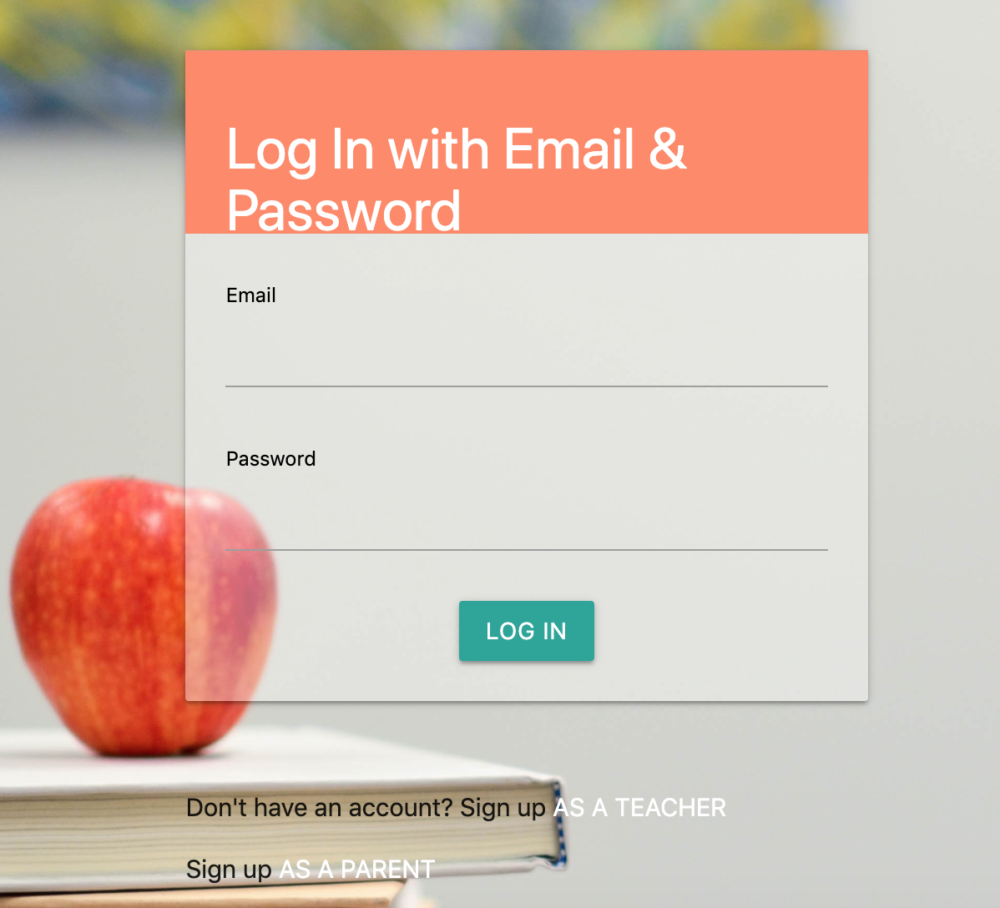
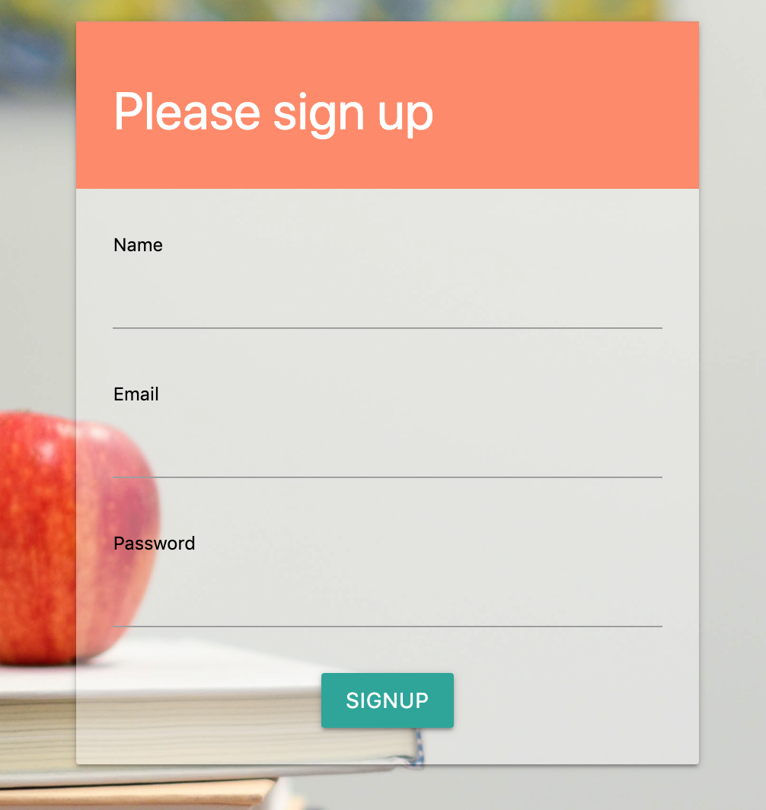
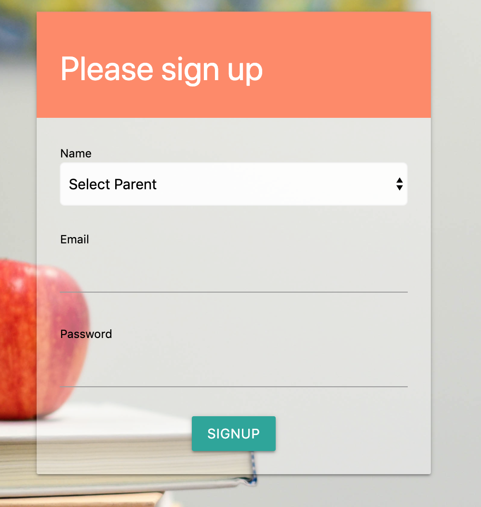
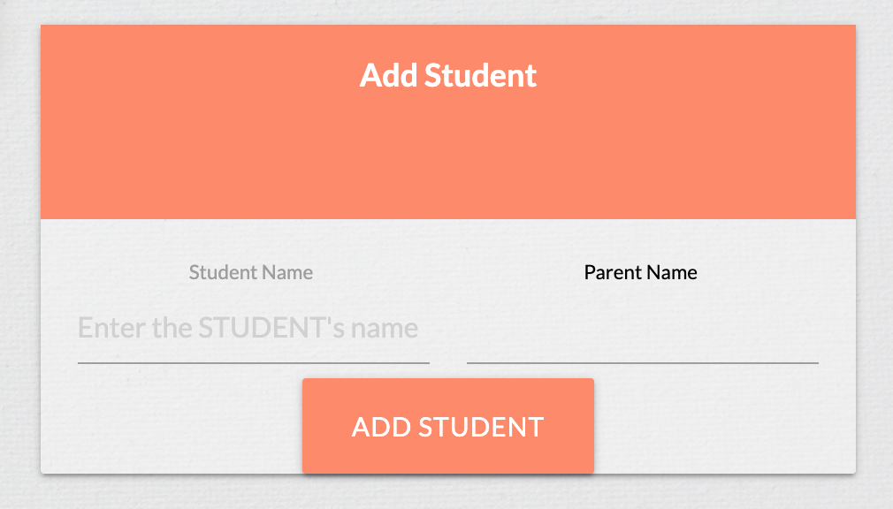
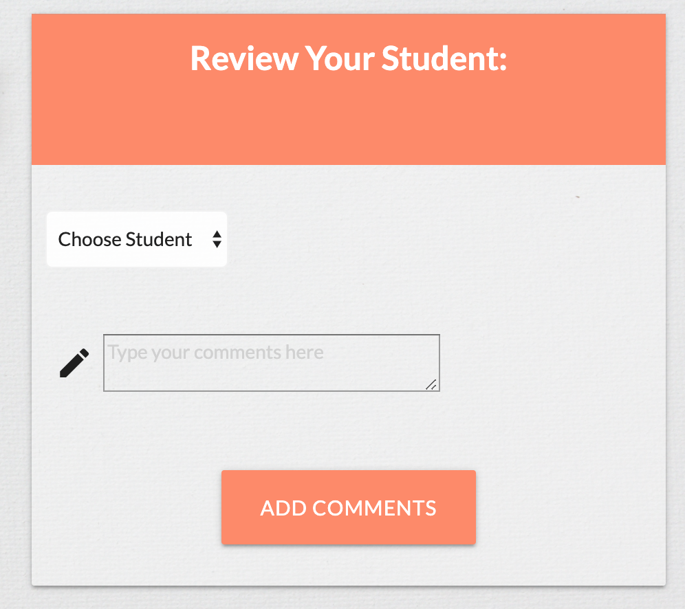
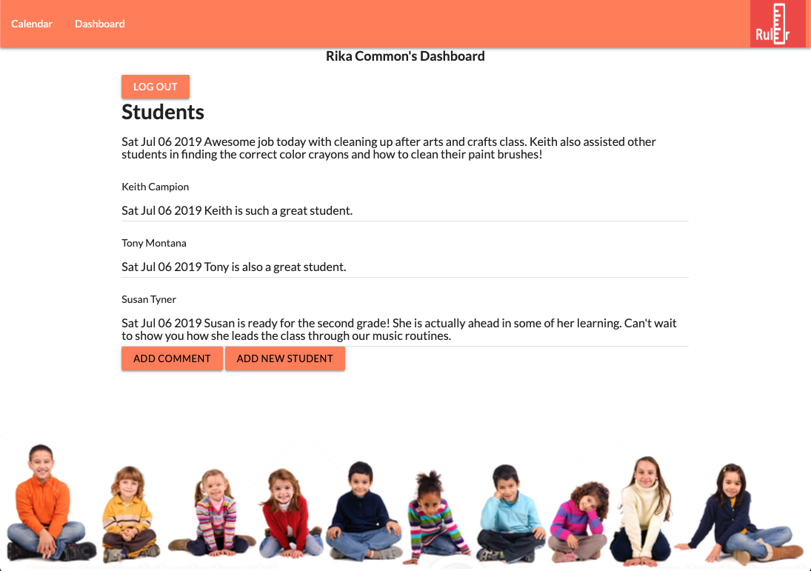
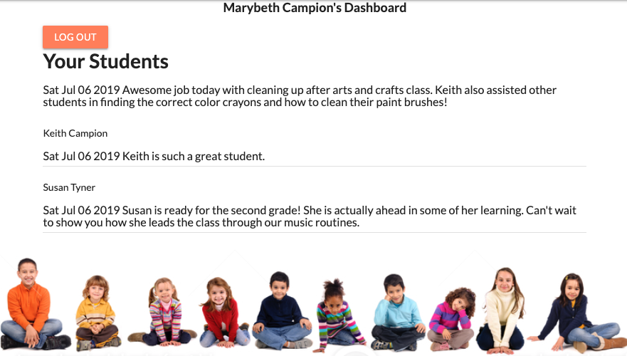
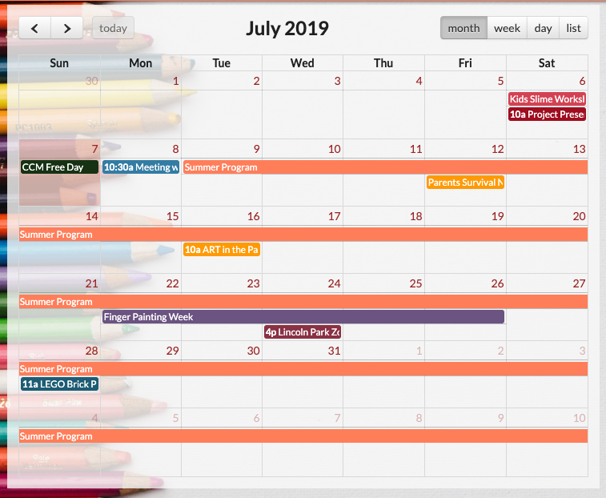

## Ruler :straight_ruler: :school:

# Project 2 Team: Rika, Maggie Jo, Dan, Bohdan

### Application Usage
Application designed for teachers and parents to keep track of the daily activities of their students/kids. Teachers can make custom comments about the students so that the parent can view later. Parent will be able to track comments, view activities, check calendar for events, and download required forms like permission slips. 

### Technologies Used
- Node.js
- Bcrypt
- Handlebars
- FullCalendar
- Sequelize
- Semantic UI(to assist with FullCalendar, not using full features)
- Materialize
- MySQL

## How It Works

First page you will see is the log in page. If you already have an account please enter your information. After you log in, the system will know to consider you either a parent or a teacher and display the appropriate dashboard. 

If you do not have an account, please set up an account as a teacher. After logging in as a teacher, you can then add a parent to the system once you add a student to your class.

After adding a student and a parent, the parent will then be able to update their information with their email address and a password in order to log in to view their dashboard for their kids. 

#Add a Student and Parent
A teacher will add a student and a parent from this page. An existing parent can also be selected from the drop down if a new account set up is not needed. 

Teacher will leave comments for students from this screen.

## Dashboard :clipboard:
A teacher can view all of the posts from their dashboard. The teacher will also find the buttons to add a student or leave a comment on the same page.

A parent can view posts on their dashboard as well. A parent will only see posts assigned to them and their kids.

## Calendar :calendar:
A teacher and parent can view the calendar of events and activities added for the summer. They can view it as a monthly calendar, weekly, or daily. Some events can open directly to a webpage for more information. Events can also be dragged and dropped to different dates if needed to update. 

### The Future
## Teacher
- Can create custom events to post to be Calendar
- Will be able to send permission slips to parents
- Add report card information 
- Update activities page and add school bulletins
- Give ratings of :blush: and :star: based on comments
- Post videos and photos of class activities

## Parent
- Respond to a post by a teacher or send general message
- View updates on the school bulletin
- Download school statements and permission slips

### :tada: Thank you ENJOY!! :school_satchel: :school:
